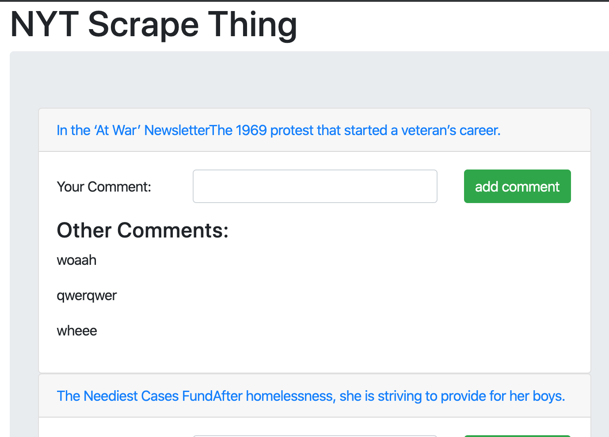

# newsapp 

A news app with user commenting

### Screenshot

### Required to run
Node
Mongod
Mongo

### Running
` $mongod`
In another shell
` $node server`
In app at home route
go to /cleareverything to clear the database
got to /scrape to re scrape the times
